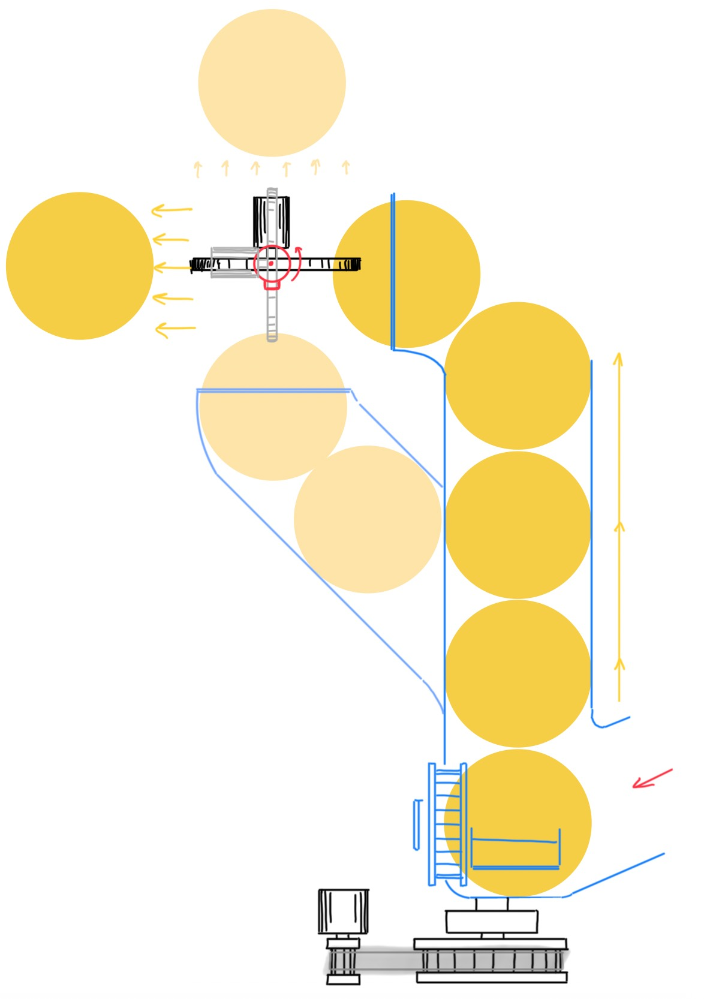
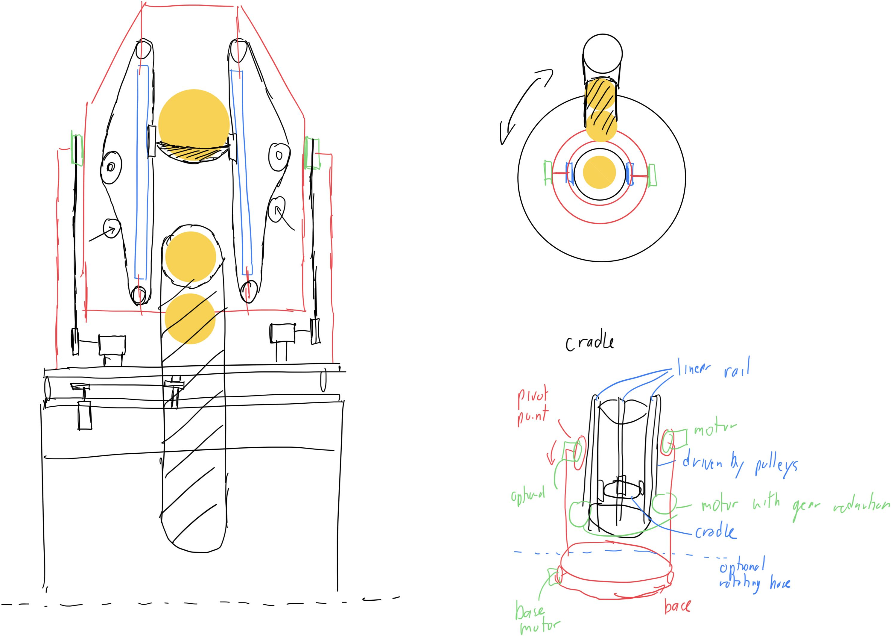
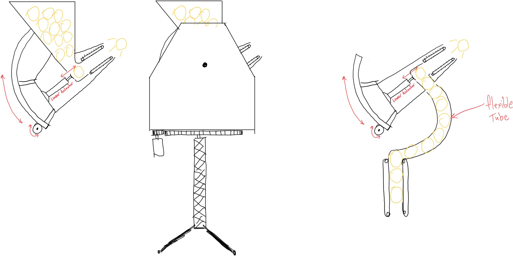
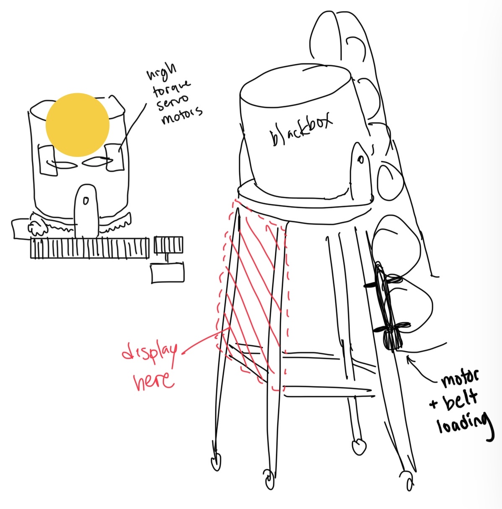
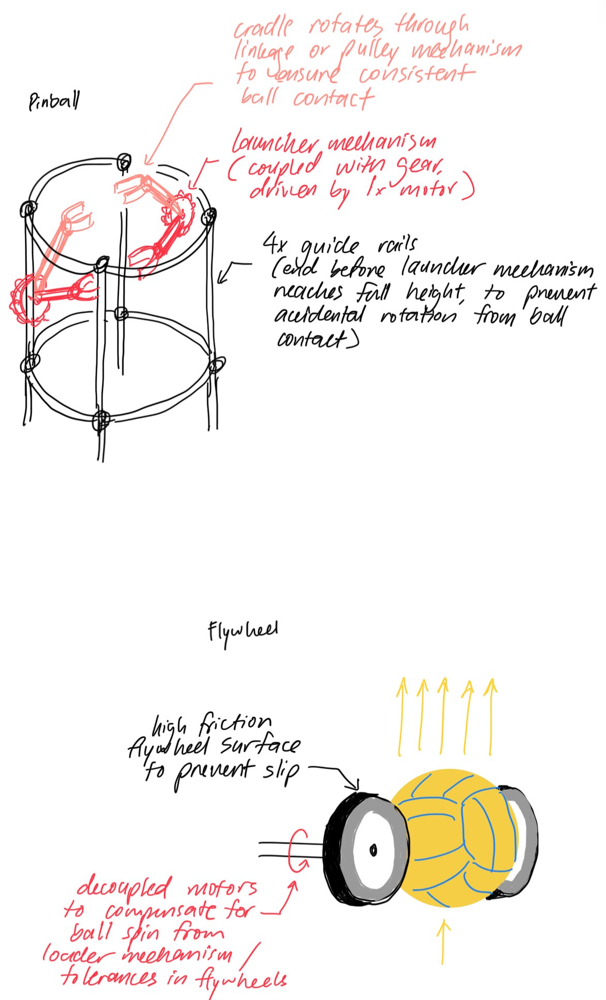
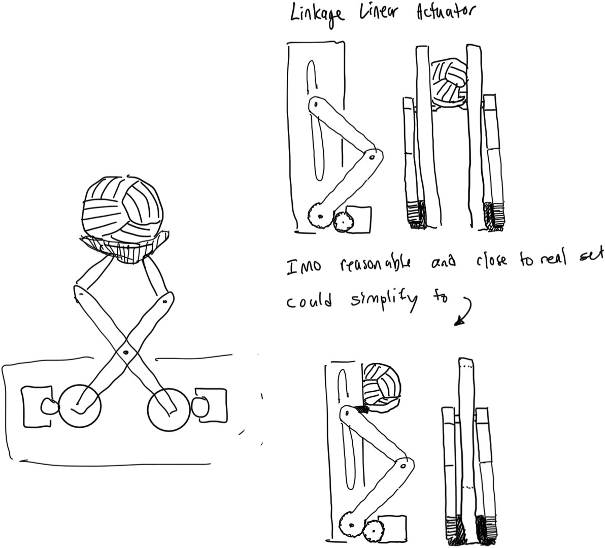
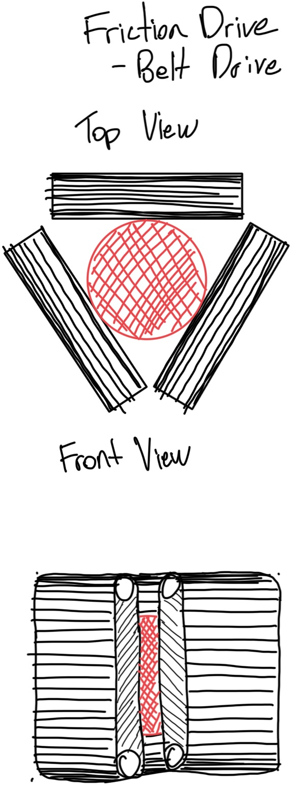

# Week 03 — Sept 21-27, 2025

## Overview 

Updated Constraints/Criteria/Objectives table after discussions last sync.   

| Criteria                  | Constraint                        | Value                          |
|---------------------------|-----------------------------------|--------------------------------|
| Spin                      | No/little spin                    | < 1 rpm                        |
| Horizontal travel of ball | Final ball position across net    | x = -6.5 to +3.25 meters       |
| Final ball position above net | Final ball position above net | y = 0.2 to 1 meters            |
| Final ball position from net | Final ball position from net   | z = 0.2 to 3 meters            |
| Arc peak above net        | Arc peak above net                | y = 0.2 to 3 meters            |
| Arc consistency           | Arc consistency                   | < 0.3 meter deviation          |
| Arc accuracy              | Arc accuracy                      | < 0.3 meter deviation          |
| Solution footprint        | Solution footprint                | x = -1 to +1 meters y = 0.75 meters (from net) |
| Volleyball capability | Compliant volleyballs | Regulation FIVB/NCAA indoor volleyballs |
| Game environment replicability | Audio/visual cues | Visuals for capture and release Audio for game status |
| User interface | Adjustable set selection | 10 front-row sets 3 back-row sets|
| Training integration | Setup time | < 30 minutes|
| Court Usability | Placement and storage | Powered and operated from 2 ½ position Fit standard gym doors |
| Safety | Automated safety features | Inaccessible pinch points Auto shutoff if tipped |
| Affordability | Cost | < $3000 CAD |

| Objective                         | Value                          |
|-----------------------------------|--------------------------------|
| No/little spin                    | 0 rpm                          |
| Final ball position across net    | x = -8 to +5 meters             |
| Final ball position from net      | z = -0.5 to +5 meters           |
| Arc peak above net                | y = 0.2 to 5 meters            |
| Arc consistency                   | < 0.1 meter deviation          |
| Arc accuracy                      | < 0.1 meter deviation          |
| Solution footprint                | x = -0.75 to +0.75 meters y = 0.75 meters (from net) |
| Compliant volleyballs | All standard size volleyballs |
| Adjustable set selection | Any custom set placement and arc |
| Setup time | < 15 minutes|
| Cost | < $2500 CAD |

### Related Patents
| Active Launchers | Passive Holders |
|------------------|-----------------|
| [Two-wheeled volleyball serving machine](https://patents.google.com/patent/US5964209A/en) | [Passive ball holder for singular ball](https://patents.google.com/patent/US3897950A/en) | 
| [Two-wheeled volleyball serving machine](https://patents.google.com/patent/US5964209A/en) | [Passive ball holder with ball storage and loading](https://patents.google.com/patent/US8371964B2/en) |
| [Three-wheeled volleyball serving machine](https://patents.google.com/patent/US9623313B1/en) |
| [Lever arm volleyball launcher](https://patents.google.com/patent/CN201470034U/en)           |
| [Tennis ball launcher](https://patentimages.storage.googleapis.com/db/ac/14/f978d6d223524c/EP3206483B1.pdf) |

### Solutions
Solution A

Solution B

Solution C

Solution D

### Additional Sketches

## Individual Updates

### **Austin**
* Reorganized Constraints/Criteria/Objectives
* Proposed designs for a belt driven ball launching mechanism, and conducted research
* Co-write and submitted application for Engineer of the Future Fund
* Discussed embedded system implementation details

### **Grace**
* Defined functional sub-modules for design solution brainstorming
* Conceptualized solutions for sub-modules and evaluated based on criteria
    * Downselected to active motor-driven launcher instead of passive spring-loaded mechanism
* Refined 'flywheel' and 'pinball' launcher mechanisms
* Enabling 'flywheel' proof-of-concept prototype to understand mechanism limitations
    * Designed 3D printed parts that reuse motors & hardware of existing ball launcher

### **Kevin**
* Brainstormed designs for different sub-systems
* Conceptual design of launching mechanisms
* Printed parts for prototype launcher for testing
* Wrote and submitted application for Engineer of the future fund

### **Vincent**
* Find patents for passive volleyball hitter trainers and active volleyball launchers
* Reorganized Constraints/Criteria/Objectives
    - Created new tables based on discussion
* Formulated linear actuator launching mechanisms
    - Cradle on linear rails to hold the ball
    - Launched by pulley system driven by motors
* Website management
