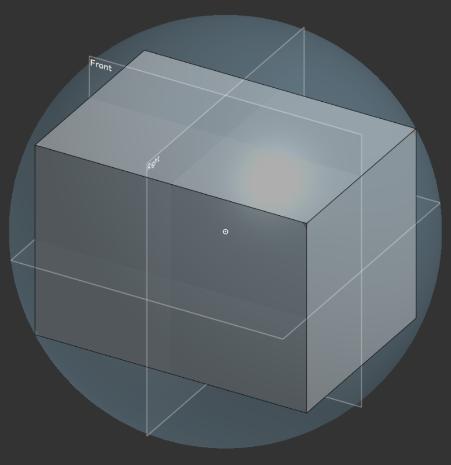

# Week 07 — Oct 19-25, 2025

## Overview 

The team began a deep dive in the design and considerations for different launching mechanisms to be prototyped. After successfully demonstrating the flywheel design, the pinball and linear actuator mechanisms were discussed and ME CAD and EE schematics were started to be developed.

## Individual Updates

### **Austin**

* Started to adapt stepper and serveo motor controller code to specific apllications
    * Looked into migrating code to different microcontroller and SBC platforms

### **Grace**

* Designed proof-of-concept (POC) prototype 'pinball' launcher mechanism, with decoupled 'cradle' and 'flipper' features
* Conducted preliminary motor sizing calculations to validate reusing existing motors for POC 'pinball' launcher
* Sourced various hardware and components for POC 'pinball' launcher

### **Kevin**

* Designed proof of concept prototype for linear actuator launcher mechanism
* Sourced and ordered components and started building prototype
* Conducted preliminary calculations

### **Vincent**

* Compared several motor options for different launching mechanisms
    * Provide initial motor driver recommendations for servos and BLDCs
    * Found initial motors and drivers for each topology
* Discussed design considerations of carriage for linear and pinball launching mechanisms
