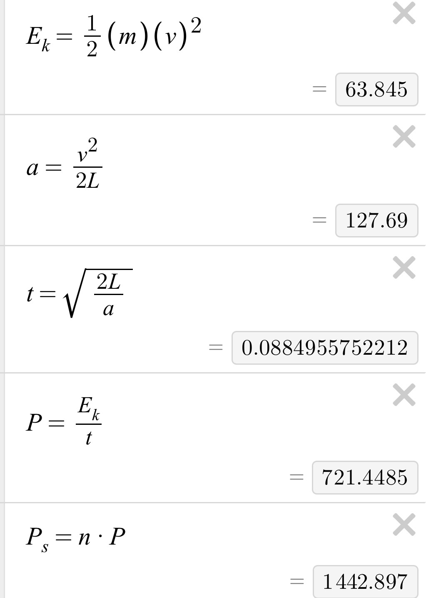

# Week 09 — Oct 2 - Nov 8, 2025

## Overview 

Built up prototypes for pinball and linear actuator mechanisms. Tested and weighted each prototype against different categories with complete mechanism in mind, and concluded to proceed with linear actuator. Every member performed relevant calculations, tested prototypes, and debated launching mechanism with specific associated engineering challenges.

### Prototype Notes

| Notes | Linear | Flywheel |
|-|-|-|
|Power Spec|Conservative 1500W|Only need torque to spin up motors in a reasonable time|
|Braking|64J over some time but can be motor braking or mechanical|NA but need to brake during flywheel speed changes|
|Deadtime |Fixed feeder that needs to be homed|Change in flywheel speed|
|Footprint|Longer travel length|Needs more space for complex loader/feeder|
|Cost|More engineering design time|Simpler launching but more complex system|
|A/V cues|Byproduct|Need to integrate separately |
|Noise|Only during launching|Constant|
|Repeatability/Consistency|Velocity feedback of ball every time  Ball dimensions, weight, and pressure does not matter|Need to worry about slip of the ball and flywheel  Can have compliant flywheel mechanism to maintain normal force Cannot have exit velocity feedback|
|Loading| Fixed feeder|Needs additional feeder that moves |

### Calculations

## Individual Updates

### **Austin**

* Built a power budget calculator for speccing power electronics (motors, controllers, batteries)
* Researched motors, motor controllers, and batteries with given specs

### **Grace**

* Built proof-of-concept (POC) prototype 'pinball' launcher mechanism
* Developed new rankings for evaluating 'linear actuator' vs 'flywheel' launcher mechanisms, after better understanding from POC prototypes
* Downselected to linear actuator launcher

### **Kevin**

* Designed assembled and tested proof of concept for linear actuator mechanism
* Purchased motor driver components

### **Vincent**

* Finalized motor and power architecture after performing calculations
* Selected and procured motors, motor drivers, batteries, sensors, and harnesses
* Developed communication architecture from SBC to motor drivers

